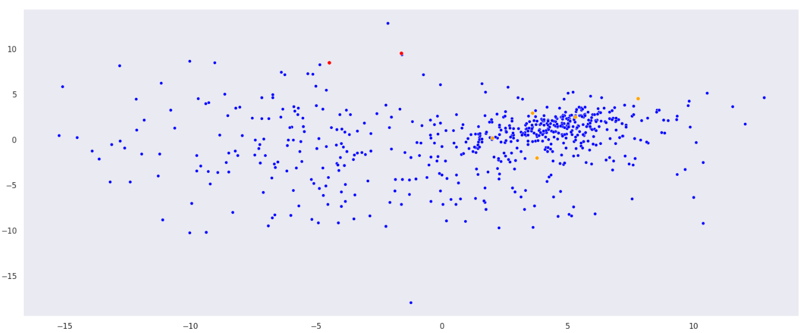
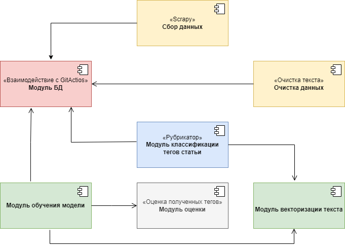
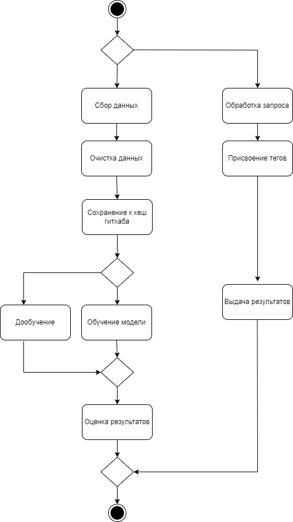

# Описание проекта
## Название проекта: Рубрикатор
### Цель: Предсказание тега на основе полученной статьи

# Репозиторий 

>[Рубрикатор](https://github.com/VegaMethadone/Architecture-of-AI-systems)

# Задачи:
>1. Разработка архитектуры системы.
>2. Подготовка исходных данных.
>3. Обучение и оценка моделей на исходном датасете.
>4. Выбор наиболее оптимальной модели.
>5. Развертывание наилучшей модели.  

# Датасет

>[Обучающие данные](https://www.kaggle.com/datasets/shilongzhuang/red-and-white-wine-quality)

# Целесообразность использования датасета
>С помощью обученной модели можно предалагать проставлять теги авторам статеьей, чтобы избежать неверного тега или облегчить выбор темы тега статьи 
>
>С помощью метода главных компонент можно увидеть распределение предикторов в двумерном пространстве. Желтым цветом были выделенны векторы, которые могут описать кластер слов, которые встречаются в тексте. Красным - слова, которые не встречаются в тексте. Как видно из графика, слова, которые не встречаются в тексте (красные) и,которые не имеют значительного веса в текста - разбросаны по граффику  и не образуют класстеры. С желтыми наоборот - они похоже по смыслу с другими словами, поэтому они рядом и могут описать кластер к которому принадлежат. 

### Диаграмма компонентов

### Диаграмма активностей процесса работы системы

## Deployment diagram

