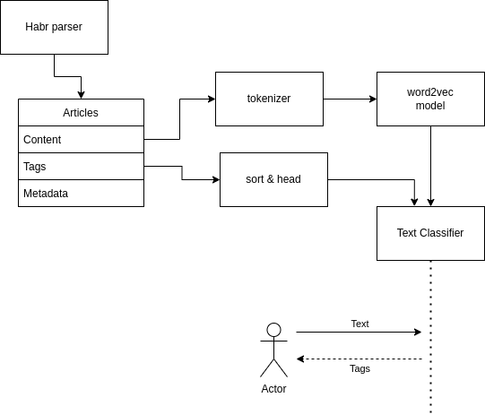

# Разработка архитектуры системы


На данном этапе мы разрабатывали архитектуру системы, и решили разделить весь воркфлоу на четыре основных части:


### 1. Парсинг статей с хабра

Наш краулер собирает список новейших статей с хабра, и складывает их в директорию примерно в таком виде:

```json
{
    "article_id": 1,
    "article_name": "Название",
    "content": "Тут текст статьи и много много разных слов",
    "tags" ["список", "тегов"]
}
```

Каждая статься представлена в виде отдельного файла с таким наполнением, сам файл имеет название `article_{id}.json`

Такой подход позволит дополнять данные с течением времени


### 2. Нормализация данных

Второй этап - очистка, нормализация данных. Этот шаг нужен, чтобы дальше при обучении не пришлось проводить много операций над большим массивом данных.


### 3. Обучение модели

Артефактом данного этапа является обученная модель в виде файла.


### 4. Построение отчета

После обучения модели мы хотим получить автоматически сгенерированный отчет, чтобы иметь возможность отслеживать изменение качества резульаттов при изменении каких-либо параметров.


Выглядит примерно так:


